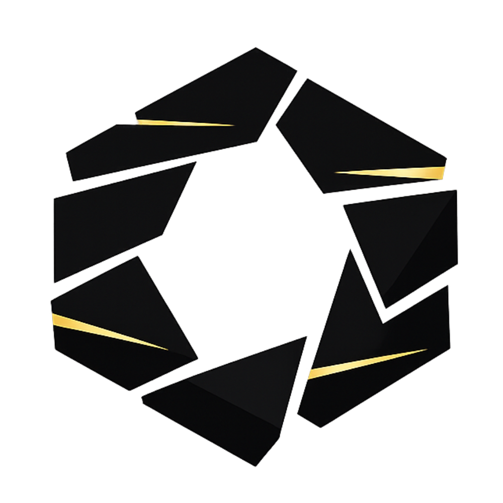

<p align="center">
  
</p>
<h1 align="center">Tumulte</h1>
<p align="center">
  <strong>Multi-stream Twitch poll system for Tabletop RPG sessions</strong>
</p>

<p align="center">
  <a href="https://github.com/The-Genium007/tumulte/releases"></a>
  <a href="./LICENSE"></a>
  <br>
  
  
  
  
</p>

<p align="center">
  <a href="#features">Features</a> •
  <a href="#quick-start">Quick Start</a> •
  <a href="#documentation">Documentation</a> •
  <a href="#contributing">Contributing</a>
</p>

---

**Tumulte** enables Game Masters (GMs) to launch synchronized Twitch polls across multiple streams during TTRPG sessions. Viewers vote on their favorite streamer's chat, and results are aggregated in real-time with a transparent OBS overlay.

> **Early Alpha** - Functional but not production-ready. Breaking changes may occur between versions.

---

## Table of Contents

- [Features](#features)
- [Quick Start](#quick-start)
- [Tech Stack](#tech-stack)
- [Deployment](#deployment)
- [Known Limitations](#known-limitations)
- [Roadmap](#roadmap)
- [Contributing](#contributing)
- [License](#license)
- [Acknowledgments](#acknowledgments)

---

## Features

### For Game Masters
- **Campaign Management** - Create campaigns and invite streamers via Twitch username
- **Dual Security Validation** - Streamers must accept the campaign AND be manually authorized per session
- **Synchronized Polls** - Launch polls that appear simultaneously on all participating streams
- **Real-time Aggregation** - View votes from all chats in real-time
- **Session Control** - Full control over when and how polls are launched
- **🎲 VTT Integration** - Connect Foundry VTT, Roll20, or Alchemy RPG to display dice rolls on overlays (v0.5.0+)

### For Streamers
- **One-click Auth** - OAuth Twitch authentication
- **Invitation System** - Accept or decline campaign invitations
- **Per-session Validation** - GM must authorize you before each session (prevents unwanted polls)
- **Compatibility** - Works for Twitch Affiliates and Partners

### Overlay Studio (Preview developer)
- **Visual Editor** - Design your poll overlay with real-time preview
- **Custom Animations** - Entry, loop, result and exit animations
- **OBS Integration** - Transparent overlay for Browser Source
- **Live Preview** - Test animations synchronized with OBS overlay

---

## Quick Start

### Prerequisites

- Node.js v20+
- Docker & Docker Compose
- [Twitch Developer Application](https://dev.twitch.tv/console/apps)
- PostgreSQL 16 & Redis 7 (via Docker or existing)

### Installation

```bash
# Clone the repository
git clone https://github.com/The-Genium007/tumulte.git
cd tumulte

# Start Redis
cd backend && docker compose up -d

# Setup backend
cp .env.example .env
npm install
node ace migration:run
npm run dev  # Runs on port 3333

# Setup frontend (new terminal)
cd ../frontend
cp .env.example .env
npm install
npm run dev  # Runs on port 3000
```

### Twitch OAuth Configuration

Create an app on [Twitch Developers Console](https://dev.twitch.tv/console/apps) and configure `backend/.env`:

```env
TWITCH_CLIENT_ID=your_client_id
TWITCH_CLIENT_SECRET=your_client_secret
TWITCH_REDIRECT_URI=http://localhost:3333/auth/twitch/callback

# Authorized GM Twitch IDs (comma-separated)
MJ_TWITCH_IDS=123456789,987654321
```

**Required scopes**: `channel:manage:polls`, `channel:read:polls`, `user:read:email`

### Access Points

| Service | URL |
|---------|-----|
| Frontend | http://localhost:3000 |
| Backend API | http://localhost:3333 |
| OBS Overlay | http://localhost:3000/overlay/{streamerId} |
| VTT Webhook | http://localhost:3333/webhooks/vtt/dice-roll |

### VTT Integration (v0.5.0+)

To integrate your Virtual Tabletop:

```bash
# Run the VTT provider seeder
cd backend
node ace db:seed

# Create a test VTT connection
node ace vtt:create-test

# Install the Foundry VTT module
# See modules-vtt/foundry/README.md for details
```

**Supported VTT Platforms:**
- ✅ **Foundry VTT** (v11+) - Module ready
- 📋 **Roll20** (API Script for Pro) - Coming soon
- 📋 **Alchemy RPG** (Browser Extension) - Coming soon

**Documentation:**
- [VTT Integration Complete Guide](./docs/vtt-integration/complete-guide.md)
- [Quick Start Testing Guide](./docs/vtt-integration/quick-start.md)
- [Foundry Module README](./modules-vtt/foundry/README.md)

---

## OBS Browser Source Setup

To add the poll overlay to your stream:

1. In OBS, add a **Browser Source**
2. Set the URL to: `http://localhost:3000/overlay/{your-streamer-id}`
3. Set dimensions to **1920x1080** (or your stream resolution)
4. Enable **"Shutdown source when not visible"** = OFF
5. Enable **"Refresh browser when scene becomes active"** = OFF

> **OBS 32+ Compatibility**: The overlay is fully compatible with OBS Studio 32.0.1+. For best results, use the latest OBS version to avoid Browser Source issues when switching scenes.

---

## Tech Stack

| Layer | Technology |
|-------|------------|
| **Backend** | AdonisJS 6, Lucid ORM, VineJS, Transmit WebSocket |
| **Frontend** | Nuxt 3, Vue 3, Nuxt UI v3, Pinia, Axios |
| **Database** | PostgreSQL 16, Redis 7 |
| **Infrastructure** | Docker, GitHub Actions CI/CD |

---

## Deployment

### Docker Compose

The project provides separate Docker Compose files for flexible deployment:

```bash
# Backend (includes Redis)
cd backend && docker compose up -d

# Frontend
cd frontend && docker compose up -d
```

### Database Migrations

Migrations run automatically on container startup via `docker-entrypoint.sh`.

Manual commands:
```bash
docker compose exec backend node ace migration:run
docker compose exec backend node ace migration:status
```

### Resource Allocation

| Service | CPU | RAM |
|---------|-----|-----|
| Backend | 1 | 512 MB |
| Frontend | 0.5 | 256 MB |
| PostgreSQL | 1 | 1 GB |
| Redis | 0.5 | 256 MB |

---

## Known Limitations

- Only Twitch **Affiliates** or **Partners** can use polls
- Maximum **5 choices** per poll (Twitch API limit)
- Maximum poll duration: **1800 seconds** (30 minutes)

---

## Roadmap

> **Full roadmap**: [GitHub Project Board](https://github.com/users/The-Genium007/projects/4)

- **v0.4.0** - Visual Identity ✅
- **v0.5.0** - VTT Integrations 🎲 (In Progress)
  - Backend API & WebSocket ✅
  - Foundry VTT Module ✅
  - Roll20 API Script 📋
  - Alchemy RPG Extension 📋
  - Frontend GM Pages 📋
  - Overlay Components 📋
- **v0.6.0** - Gamification
- **v0.7.0** - Gamification Advanced
- **v0.8.0** - Advanced Overlay
- **v0.9.0** - Multi-Platform
- **v1.0.0** - Production Ready

---

## Contributing

The project is in active development and **contributions are not yet open** formally.

**Coming soon**: Once beta is reached, we'll open contributions with a detailed CONTRIBUTING.md guide.

**In the meantime**:
- Report bugs via [Bugs & Issues](https://github.com/The-Genium007/Tumulte/discussions/categories/bugs-issues)
- Suggest improvements in [Ideas & Suggestions](https://github.com/The-Genium007/Tumulte/discussions/categories/ideas-suggestions)
- Star the project if you find it useful!

---

## License

This project is licensed under the **MIT License** - see the [LICENSE](./LICENSE) file for details.

You are free to use, modify, distribute, and sell this software without any restrictions.

---

## Acknowledgments

Built with:

[AdonisJS](https://adonisjs.com/) • [Nuxt](https://nuxt.com/) • [Nuxt UI](https://ui.nuxt.com/) • [Twitch API](https://dev.twitch.tv/docs/api/) • [PostgreSQL](https://www.postgresql.org/) • [Redis](https://redis.io/)

---

<p align="center">
  <strong>Made for the TTRPG Twitch community</strong>
  <br><br>
  <a href="https://github.com/The-Genium007/Tumulte">Star this project</a> •
  <a href="https://github.com/The-Genium007/Tumulte/discussions/categories/bugs-issues">Report a bug</a> •
  <a href="https://github.com/The-Genium007/Tumulte/discussions/categories/ideas-suggestions">Suggest a feature</a>
</p>
