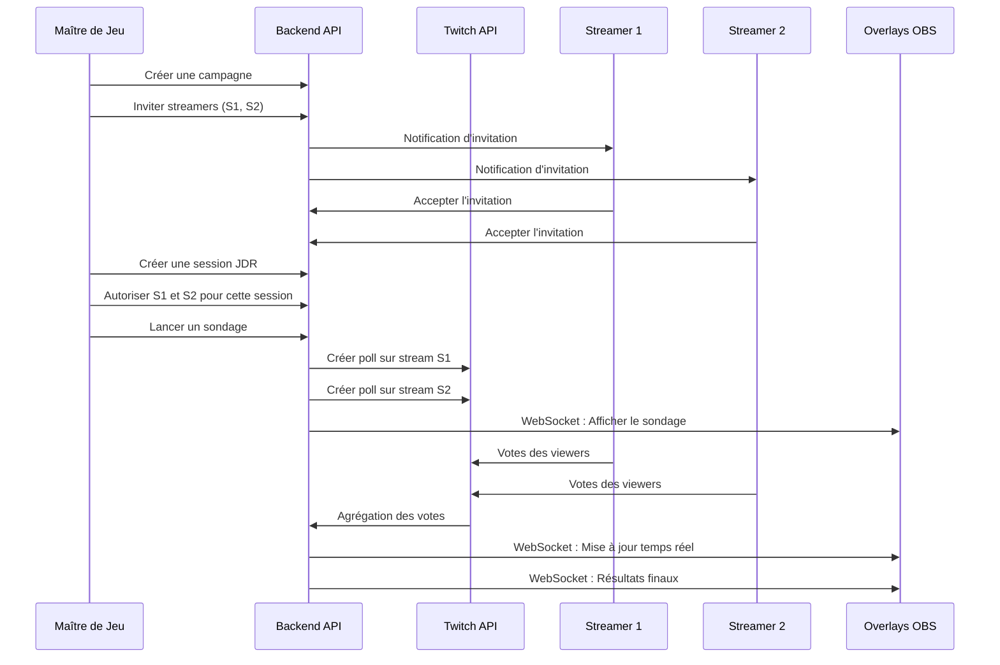

# 🎲 Tumulte

> Système de sondages multi-stream pour sessions de jeu de rôle sur Twitch

[](https://creativecommons.org/licenses/by-nc/4.0/)
[](https://github.com/The-Genium007/tumulte/releases)
[]()
[](https://github.com/The-Genium007/Tumulte/actions/workflows/staging-ci.yml)
[](https://github.com/The-Genium007/Tumulte/actions/workflows/production-ci.yml)

**Tumulte** permet à un Maître de Jeu (MJ) de lancer des sondages Twitch synchronisés sur plusieurs streams simultanément durant une partie de JDR. Les joueurs votent sur le chat de leur streamer préféré, et les résultats sont agrégés en temps réel avec un overlay OBS transparent.

---

## 🚀 Version actuelle : Alpha précoce

> **Note importante** : Tumulte est actuellement en développement initial. Cette version alpha est fonctionnelle mais n'est pas encore mature pour une utilisation en production à grande échelle. Des changements importants peuvent survenir entre les versions.

**État du projet :**
- ✅ Authentification Twitch (streamers + MJ)
- ✅ Gestion de campagnes et invitations
- ✅ Double validation de sécurité (acceptation campagne + session)
- ✅ Création de sondages multi-stream synchronisés
- ✅ Agrégation des votes en temps réel
- ✅ Overlay OBS avec WebSocket
- 🚧 Interface utilisateur en amélioration continue
- 🚧 Tests et stabilisation
- 📋 Documentation complète (à venir)

---

## ✨ Fonctionnalités

### Pour les Maîtres de Jeu
- **Campagnes sécurisées** : Créez des campagnes et invitez des streamers via leur pseudo Twitch
- **Double validation** : Les streamers doivent accepter la campagne ET être autorisés manuellement à chaque session JDR
- **Sondages synchronisés** : Lancez un sondage qui apparaît simultanément sur tous les streams participants
- **Résultats agrégés** : Visualisez les votes de tous les chats en temps réel
- **Gestion de session** : Contrôle total sur quand et comment les sondages sont lancés

### Pour les Streamers
- **Connexion simple** : Authentification OAuth Twitch en un clic
- **Invitations sécurisées** : Acceptez ou refusez les invitations de campagne
- **Validation par session** : Le MJ doit vous autoriser manuellement avant chaque session (évite les sondages non désirés)
- **Overlay OBS** : URL d'overlay personnalisée avec fond transparent
- **Compatibilité** : Fonctionne pour les streamers Twitch Affiliés ou Partenaires

### Overlay OBS
- Fond transparent pour intégration fluide
- Mise à jour en temps réel via WebSocket
- Barres de progression et compte à rebours
- Affichage/masquage automatique au début/fin du sondage

---

## 🛠️ Stack technique

### Backend
- **Framework** : AdonisJS v6 (TypeScript)
- **ORM** : Lucid (PostgreSQL)
- **WebSocket** : Transmit (AdonisJS)
- **Cache** : Redis 7
- **Authentification** : Session + JWT
- **Validation** : VineJS
- **Monitoring** : Sentry
- **API** : Twitch Helix API

### Frontend
- **Framework** : Nuxt 3 (Vue.js 3 + TypeScript)
- **UI** : Nuxt UI v3 (TailwindCSS + Headless UI)
- **State** : Pinia
- **HTTP** : Axios
- **WebSocket** : Transmit Client
- **PWA** : Vite PWA

### Infrastructure
- **Base de données** : PostgreSQL 16
- **Cache** : Redis 7
- **Conteneurisation** : Docker + Docker Compose
- **Déploiement** : Dokploy
- **CI/CD** : GitHub Actions (tests automatiques)
- **Reverse Proxy** : Cloudflare Tunnel (optionnel)

---

## 📋 Prérequis

- **Node.js** v20 ou supérieur
- **Docker** et **Docker Compose**
- **Application Twitch Developer** ([Créer une app](https://dev.twitch.tv/console/apps))
- **PostgreSQL 16** (via Docker ou existant)
- **Redis 7** (via Docker ou existant)

---

## 🚀 Démarrage rapide

### Développement local

```bash
# 1. Cloner le dépôt
git clone https://github.com/The-Genium007/tumulte.git
cd tumulte

# 2. Démarrer Redis (depuis le dossier backend)
cd backend
docker compose up -d

# 3. Configurer le backend
cp .env.example .env
# Éditer .env avec vos credentials Twitch et connexion PostgreSQL
npm install
node ace migration:run
npm run dev  # Port 3333

# 4. Configurer le frontend (dans un autre terminal)
cd ../frontend
cp .env.example .env
# Éditer .env pour pointer vers http://localhost:3333
npm install
npm run dev  # Port 3000
```

### Configuration Twitch OAuth

Créez une application sur [Twitch Developers Console](https://dev.twitch.tv/console/apps) et ajoutez dans `backend/.env` :

```env
TWITCH_CLIENT_ID=votre_client_id
TWITCH_CLIENT_SECRET=votre_client_secret
TWITCH_REDIRECT_URI=http://localhost:3333/auth/twitch/callback

# ID Twitch des MJ autorisés (séparés par virgules)
MJ_TWITCH_IDS=123456789,987654321
```

**Scopes requis** : `channel:manage:polls`, `channel:read:polls`, `user:read:email`

**Trouver votre Twitch User ID** : [StreamWeasels Converter](https://www.streamweasels.com/tools/convert-twitch-username-to-user-id/)

### Accès à l'application

- **Frontend** : http://localhost:3000
- **Backend API** : http://localhost:3333
- **Overlay** : http://localhost:3000/overlay/:streamerId

---

## 🐳 Déploiement avec Docker Compose

Le projet fournit deux fichiers Docker Compose séparés pour un déploiement flexible (compatible [Dokploy](https://dokploy.com)) :

### Backend (`backend/docker-compose.yml`)

**Services inclus** :
- Redis 7 (cache et sessions)

**Configuration requise** :
- PostgreSQL externe (fourni par votre infrastructure)
- Variables d'environnement dans `.env`

```bash
cd backend
docker compose up -d
```

### Créer et mettre à jour la base de données

**Migrations automatiques** : Les migrations de base de données s'exécutent **automatiquement au démarrage** du conteneur backend via le script [docker-entrypoint.sh](backend/docker-entrypoint.sh). Sur Dokploy, à chaque déploiement, la base de données sera automatiquement créée ou mise à jour.

**Commandes manuelles** (si nécessaire) :

```bash
# Exécuter les migrations manuellement
docker compose exec backend node ace migration:run

# Vérifier l'état des migrations
docker compose exec backend node ace migration:status

# Rollback de la dernière migration (en cas de problème)
docker compose exec backend node ace migration:rollback

# Voir toutes les commandes AdonisJS disponibles
docker compose exec backend node ace list
```

### Frontend (`frontend/docker-compose.yml`)

**Service inclus** :
- Application Nuxt buildée (servie par Node)

```bash
cd frontend
docker compose up -d
```

### Déploiement sur Dokploy

1. **Créer deux services séparés** dans Dokploy :
   - `tumulte-backend` : Point sur `/backend` avec `docker-compose.yml`
   - `tumulte-frontend` : Point sur `/frontend` avec `docker-compose.yml`

2. **Configurer PostgreSQL** : Créer un service PostgreSQL séparé dans Dokploy

3. **Variables d'environnement** : Configurer les `.env` via l'interface Dokploy

4. **Network** : Les services communiquent via le réseau Docker par défaut

**Allocation de ressources recommandée** :
- Backend : 1 CPU, 512 MB RAM (minimum)
- Frontend : 0.5 CPU, 256 MB RAM (minimum)
- PostgreSQL : 1 CPU, 1 GB RAM
- Redis : 0.5 CPU, 256 MB RAM

---

## 🎯 Comment ça marche ?

### Workflow complet



### Système de sécurité double validation

**Pourquoi cette approche ?**
- **Niveau 1 - Campagne** : Le streamer accepte de participer à la campagne du MJ
- **Niveau 2 - Session** : Le MJ autorise manuellement le streamer avant chaque session JDR

**Avantages** :
- Évite les sondages lancés sur les streams sans prévenir
- Le streamer garde le contrôle total de son chat
- Sécurité renforcée contre les abus

---

## 📁 Structure du projet

```
tumulte/
├── backend/                    # API AdonisJS
│   ├── app/
│   │   ├── controllers/
│   │   │   ├── auth_controller.ts
│   │   │   ├── mj/            # Endpoints MJ
│   │   │   └── streamer/      # Endpoints Streamer
│   │   ├── models/            # Modèles Lucid
│   │   ├── services/          # Logique métier
│   │   │   ├── auth/
│   │   │   ├── campaigns/
│   │   │   ├── polls/
│   │   │   ├── twitch/
│   │   │   └── websocket/
│   │   ├── repositories/      # Couche d'accès données
│   │   ├── validators/        # VineJS schemas
│   │   └── dtos/              # Data Transfer Objects
│   ├── database/
│   │   └── migrations/        # Migrations PostgreSQL
│   ├── config/                # Configuration
│   └── docker-compose.yml     # Redis
│
├── frontend/                   # Dashboard Nuxt
│   ├── pages/
│   │   ├── mj/               # Interface MJ
│   │   ├── streamer/         # Interface Streamer
│   │   └── overlay.vue       # Overlay OBS
│   ├── components/
│   │   ├── ui/               # Composants Nuxt UI
│   │   └── ...
│   ├── composables/          # Logique partagée
│   ├── stores/               # Pinia stores
│   ├── api/                  # Client API
│   └── docker-compose.yml    # Service frontend
│
└── README.md
```

---

## 🐛 Dépannage

### Problèmes de connexion PostgreSQL

```bash
# Vérifier les logs backend
docker compose -f backend/docker-compose.yml logs

# Tester la connexion
docker exec -it tumulte-backend node ace list
```

### Erreurs OAuth Twitch

- Vérifiez que `TWITCH_REDIRECT_URI` correspond exactement dans la Twitch Console et `.env`
- Assurez-vous que les scopes `channel:manage:polls` et `channel:read:polls` sont configurés
- Vérifiez que l'ID Twitch du MJ est bien dans `MJ_TWITCH_IDS`

### Streamer non compatible

- Seuls les Affiliés et Partenaires Twitch peuvent créer des sondages
- Vérifiez le statut sur [Twitch Dashboard](https://dashboard.twitch.tv/settings/affiliate)

### WebSocket déconnecté

```bash
# Vérifier que Redis fonctionne
docker exec -it tumulte-redis redis-cli ping
# Doit retourner PONG

# Vérifier les logs backend
docker compose logs backend
```

---

## 🔄 Workflow de développement

Le projet utilise une stratégie GitFlow avec CI/CD automatisé via GitHub Actions :

```
developement → staging → main
    (dev)      (pre-prod)  (production)
```

### Branches

- **`developement`** : Branche de développement quotidien (aucun check automatique)
- **`staging`** : Pré-production avec CI/CD progressif (tests automatiques)
- **`main`** : Production avec CI/CD complet (tous les tests requis)

### CI/CD Staging (developement → staging)

Lors d'un merge vers `staging`, GitHub Actions exécute :
1. ✅ **Quality Checks** : Type-check + Lint (bloquant)
2. ✅ **Unit Tests** : Tests unitaires backend (bloquant)
3. ✅ **Build** : Build backend + frontend (bloquant)
4. ⚠️ **Functional Tests** : Tests fonctionnels (warning seulement)

### CI/CD Production (staging → main)

Lors d'un merge vers `main`, GitHub Actions exécute :
1. ✅ **Quality Checks** : Type-check + Lint (bloquant)
2. ✅ **Security Audit** : npm audit (bloquant)
3. ✅ **Unit Tests** : Tests unitaires (bloquant)
4. ✅ **Functional Tests** : Tests fonctionnels (bloquant)
5. ✅ **Build Production** : Build optimisé (bloquant)
6. ⚠️ **E2E Tests** : Tests end-to-end Playwright (warning)

### Guide complet

Voir [`.github/BRANCH_PROTECTION.md`](.github/BRANCH_PROTECTION.md) pour la configuration détaillée des protections de branches et du workflow de travail.

---

## 🤝 Contribution

**État actuel** : Le projet est en développement actif et **la contribution n'est pas encore ouverte** de manière formelle. Le code de base doit encore gagner en maturité et stabilité.

**Bientôt** : Une fois la version beta atteinte, nous ouvrirons les contributions avec un guide CONTRIBUTING.md détaillé.

**En attendant**, vous pouvez :
- 🐛 Signaler des bugs via [GitHub Issues](https://github.com/The-Genium007/tumulte/issues)
- 💡 Proposer des idées d'amélioration dans les Discussions
- ⭐ Mettre une étoile au projet si vous le trouvez utile !

---

## 📄 Licence

Ce projet est sous licence **Creative Commons Attribution-NonCommercial 4.0 International** (CC BY-NC 4.0).

**Vous êtes libre de** :
- ✅ Partager : copier et redistribuer le matériel sous n'importe quel format
- ✅ Adapter : remixer, transformer et créer à partir du matériel

**Selon les conditions suivantes** :
- 📝 **Attribution** : Vous devez créditer l'auteur original, fournir un lien vers la licence et indiquer si des modifications ont été effectuées
- 🚫 **Pas d'utilisation commerciale** : Vous ne pouvez pas utiliser ce matériel à des fins commerciales

Voir [LICENSE](https://creativecommons.org/licenses/by-nc/4.0/legalcode.fr) pour plus de détails.

---

## ⚠️ Limitations connues

- Seuls les streamers **Affiliés** ou **Partenaires** Twitch peuvent utiliser les sondages
- Maximum **5 choix** par sondage (limitation Twitch API)
- Durée maximale d'un sondage : **1800 secondes** (30 minutes)
- Le backend nécessite une connexion persistante à Redis pour les WebSockets
- L'overlay nécessite un navigateur moderne (WebSocket support)

---

## 🗺️ Roadmap

### Version 0.2 (Q1 2025)
- [ ] Interface MJ améliorée avec statistiques
- [ ] Historique des sondages par campagne
- [ ] Export des résultats en CSV/JSON
- [ ] Tests unitaires et d'intégration

### Version 0.3 (Q2 2025)
- [ ] Dashboard streamer avec analytics
- [ ] Templates de sondages réutilisables
- [ ] Système de notifications en temps réel
- [ ] Documentation API complète

### Version 1.0 (Q3 2025)
- [ ] Mode multi-langue (EN/FR)
- [ ] Thèmes personnalisables pour l'overlay
- [ ] Support Discord pour notifications
- [ ] Ouverture des contributions communautaires

---

## 🙏 Remerciements

Construit avec amour en utilisant :
- [AdonisJS](https://adonisjs.com/) - Framework Node.js élégant
- [Nuxt](https://nuxt.com/) - Framework Vue.js intuitif
- [Nuxt UI](https://ui.nuxt.com/) - Composants UI modernes
- [Twitch API](https://dev.twitch.tv/docs/api/) - API Helix officielle
- [Dokploy](https://dokploy.com/) - Plateforme de déploiement open-source
- [PostgreSQL](https://www.postgresql.org/) - Base de données robuste
- [Redis](https://redis.io/) - Cache ultra-rapide

---

## 📞 Contact & Support

- **Issues** : [GitHub Issues](https://github.com/The-Genium007/tumulte/issues)
- **Discussions** : [GitHub Discussions](https://github.com/The-Genium007/tumulte/discussions)

---

<div align="center">

**Fait avec ❤️ pour la communauté JDR Twitch**

[⭐ Star ce projet](https://github.com/The-Genium007/tumulte) · [🐛 Reporter un bug](https://github.com/The-Genium007/tumulte/issues) · [💡 Proposer une feature](https://github.com/The-Genium007/tumulte/discussions)

</div>
