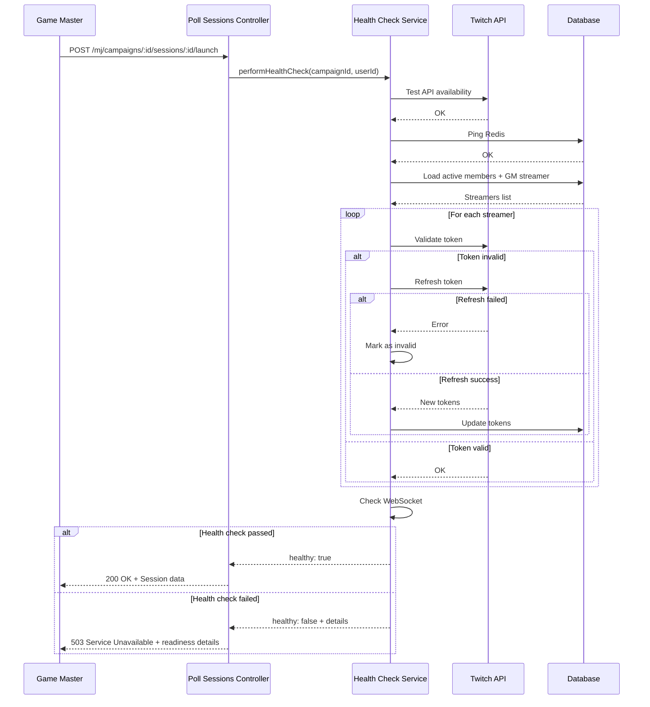

# Health Check System

The Health Check System verifies that all critical components and services are operational before launching a poll session. This prevents launching sessions when streamers cannot participate due to technical issues.

## Overview

The health check is automatically triggered when a GM attempts to launch a poll session. It validates:

1. **Twitch API Availability** - Ensures Twitch's API is reachable
2. **Redis Connection** - Verifies cache layer is operational
3. **Streamer Tokens** - Validates all participating streamers have valid Twitch tokens
4. **WebSocket Server** - Confirms real-time communication is ready

If any check fails, the session launch is blocked with a `503 Service Unavailable` response.

## Architecture

### Service Location

```
backend/app/services/health_check_service.ts
```

### Dependencies

- `CampaignMembershipRepository` - Fetches active campaign members
- `UserRepository` - Retrieves GM's streamer profile
- `TokenRefreshService` - Attempts auto-refresh of invalid tokens
- `RedisService` - Tests cache connectivity
- `Transmit` - WebSocket service

## Health Check Components

### 1. Twitch API Check

Verifies Twitch's API is accessible by:

1. Obtaining an app access token via OAuth2 client credentials flow
2. Making a test request to `GET /helix/users` endpoint
3. Validating the response status

**Configuration:**

```typescript
// Environment variables
TWITCH_CLIENT_ID=<your-client-id>
TWITCH_CLIENT_SECRET=<your-secret>
TWITCH_TEST_USER_ID=141981764  // Optional, defaults to Twitch's own user
```

**Failure Scenarios:**

- Twitch credentials not configured
- Network connectivity issues
- Twitch API outage
- Invalid client credentials

### 2. Redis Connection Check

Performs a simple ping to verify Redis is responsive.

**Implementation:**

```typescript
await this.redisService.ping()
```

**Failure Scenarios:**

- Redis server not running
- Network issues
- Connection timeout
- Authentication failure

### 3. Token Validation Check

The most comprehensive check. For each streamer participating in the campaign:

**Process:**

1. Load all active campaign members with their streamer profiles
2. Check GM's token (if GM has a streamer profile)
3. For each streamer:
   - Decrypt access and refresh tokens
   - Validate token with Twitch's `/oauth2/validate` endpoint
   - **Auto-refresh if invalid:** Attempt to refresh expired tokens
   - Mark as invalid if refresh fails

**Auto-Refresh Behavior:**

When a token is found to be invalid during health check, the system automatically attempts to refresh it using the streamer's refresh token. This happens transparently:

```typescript
// Token invalid - attempt auto-refresh
const refreshSuccess = await this.tokenRefreshService.refreshStreamerToken(streamer)
if (!refreshSuccess) {
  invalidStreamers.push({
    id: streamer.id,
    displayName: streamer.twitchDisplayName,
    error: 'Token expired or invalid (refresh failed)'
  })
}
```

**Deduplication:**

Streamers are checked only once per health check, even if they appear in multiple roles (e.g., GM who is also a campaign member).

**Response Format:**

```typescript
interface TokenCheckResult {
  valid: boolean
  invalidStreamers?: Array<{
    id: string
    displayName: string
    error: string
  }>
  error?: string
}
```

### 4. WebSocket Server Check

Validates that the Transmit WebSocket service is initialized and ready.

**Implementation:**

```typescript
if (!transmit) {
  throw new Error('Transmit WebSocket service not initialized')
}
```

## Health Check Result

### Response Structure

```typescript
interface HealthCheckResult {
  healthy: boolean
  services: {
    twitchApi: {
      available: boolean
      error?: string
    }
    redis: {
      connected: boolean
      error?: string
    }
    tokens: {
      valid: boolean
      invalidStreamers?: Array<{
        id: string
        displayName: string
        error: string
      }>
      error?: string
    }
    websocket: {
      ready: boolean
      error?: string
    }
  }
}
```

### Success Example

```json
{
  "healthy": true,
  "services": {
    "twitchApi": {
      "available": true
    },
    "redis": {
      "connected": true
    },
    "tokens": {
      "valid": true
    },
    "websocket": {
      "ready": true
    }
  }
}
```

### Failure Example

```json
{
  "healthy": false,
  "services": {
    "twitchApi": {
      "available": true
    },
    "redis": {
      "connected": true
    },
    "tokens": {
      "valid": false,
      "invalidStreamers": [
        {
          "id": "str_abc123",
          "displayName": "StreamerName",
          "error": "Token expired or invalid (refresh failed)"
        }
      ]
    },
    "websocket": {
      "ready": true
    }
  }
}
```

## Integration with Session Launch

### Flow Diagram



### Controller Implementation

```typescript
// backend/app/controllers/mj/poll_sessions_controller.ts

async launch({ auth, params, response }: HttpContext) {
  const userId = auth.user!.id
  const { campaignId, sessionId } = params

  // Perform health check
  const healthCheck = await this.healthCheckService.performHealthCheck(
    campaignId,
    userId
  )

  if (!healthCheck.healthy) {
    // If token validation failed, include readiness details
    let readinessDetails = null
    if (!healthCheck.services.tokens.valid) {
      readinessDetails = await this.readinessService.getCampaignReadiness(campaignId)
    }

    return response.status(503).json({
      error: 'System health check failed. Cannot launch session.',
      healthCheck,
      readinessDetails
    })
  }

  // Proceed with session launch...
  return response.ok({ data: sessionData })
}
```

## Logging

The health check system logs all checks with structured data:

```typescript
// Success logs
logger.info('✅ Twitch API check: OK')
logger.info('✅ Redis check: OK')
logger.info('✅ Tokens check: OK - All tokens valid')
logger.info('✅ WebSocket check: OK')

// Failure logs
logger.error({ invalidStreamers }, '❌ Tokens check: FAILED')
logger.error({ error }, '❌ Twitch API check: FAILED')

// Summary
logger.info({
  campaignId,
  healthy: result.healthy,
  twitchApi: result.services.twitchApi.available,
  redis: result.services.redis.connected,
  tokens: result.services.tokens.valid,
  websocket: result.services.websocket.ready
}, 'Health check completed')
```

## Error Handling

### Graceful Degradation

Each check is isolated with try-catch blocks. If one check fails, others still execute to provide a complete diagnostic report.

### Token Refresh Failures

When token refresh fails during health check:

1. The streamer is marked with `token_expired` or `token_refresh_failed` issue
2. The health check fails
3. The response includes `readinessDetails` for the waiting list modal
4. The streamer's `tokenRefreshFailedAt` timestamp is updated
5. The scheduler will retry refresh in 15 minutes

### Retry Policy

Token refresh failures trigger the retry policy (see [Streamer Readiness](./streamer-readiness.md) for details):

- **First failure:** Retry in 15 minutes
- **Second failure (within 30 min):** Deactivate streamer + notify

## Testing

### Unit Tests

```bash
cd backend
npm run test:unit -- tests/unit/services/health_check_service.spec.ts
```

### Functional Tests

```bash
npm run test:functional -- tests/functional/health_check.spec.ts
```

### Manual Testing

1. Start the backend: `npm run dev`
2. Create a campaign with streamers
3. Attempt to launch a session
4. Monitor logs for health check execution

## Troubleshooting

### Health Check Always Fails

**Symptoms:** All session launches return 503

**Possible Causes:**

1. **Twitch API credentials missing/invalid**
   - Check `TWITCH_CLIENT_ID` and `TWITCH_CLIENT_SECRET` in `.env`
   - Verify credentials at https://dev.twitch.tv/console

2. **Redis not running**
   - Check: `docker-compose ps` or `redis-cli ping`
   - Start: `docker-compose up -d redis`

3. **Network issues**
   - Test Twitch API: `curl https://id.twitch.tv/oauth2/token`
   - Test Redis: `redis-cli -h localhost ping`

### Specific Streamer Always Invalid

**Symptoms:** One streamer's token always fails validation

**Debugging Steps:**

1. Check streamer's token expiry in database:
   ```sql
   SELECT id, twitch_display_name, token_expires_at, token_refresh_failed_at, is_active
   FROM streamers
   WHERE id = 'str_xxx';
   ```

2. Check for refresh failures:
   ```bash
   grep "TokenRefresh.*str_xxx" logs/app.log
   ```

3. Verify streamer has valid refresh token:
   - User must re-authenticate via Twitch OAuth
   - Navigate to `/auth/twitch/redirect` when logged in as that user

### Auto-Refresh Not Working

**Symptoms:** Expired tokens not being refreshed

**Checks:**

1. Verify scheduler is running:
   ```bash
   node --loader ts-node-maintained/esm ace token:refresh --dry-run
   ```

2. Check `TokenRefreshService` logs for errors

3. Verify streamer's `isActive` is `true` and they have a `refreshTokenEncrypted`

## Performance Considerations

### Execution Time

Typical health check duration: **2-5 seconds**

- Twitch API check: ~500ms
- Redis ping: ~10ms
- Token validation: ~200ms per streamer
- WebSocket check: ~1ms

### Scaling

For campaigns with many streamers (>10):

- Token checks run sequentially to avoid rate limiting
- Consider implementing concurrency control with a semaphore
- Cache Twitch app token to avoid repeated OAuth requests

### Optimization Tips

1. **Preload relationships:** The service uses `preload('streamer')` to minimize queries
2. **Deduplicate checks:** Streamers are checked only once
3. **Fail fast:** If critical checks fail early, remaining checks still provide diagnostics

## See Also

- [Streamer Readiness](./streamer-readiness.md) - Waiting list system for unready streamers
- [Token Refresh](./TOKEN_REFRESH.md) - Automatic token refresh scheduler
- [WebSocket Events](./websockets.md) - Real-time communication system
