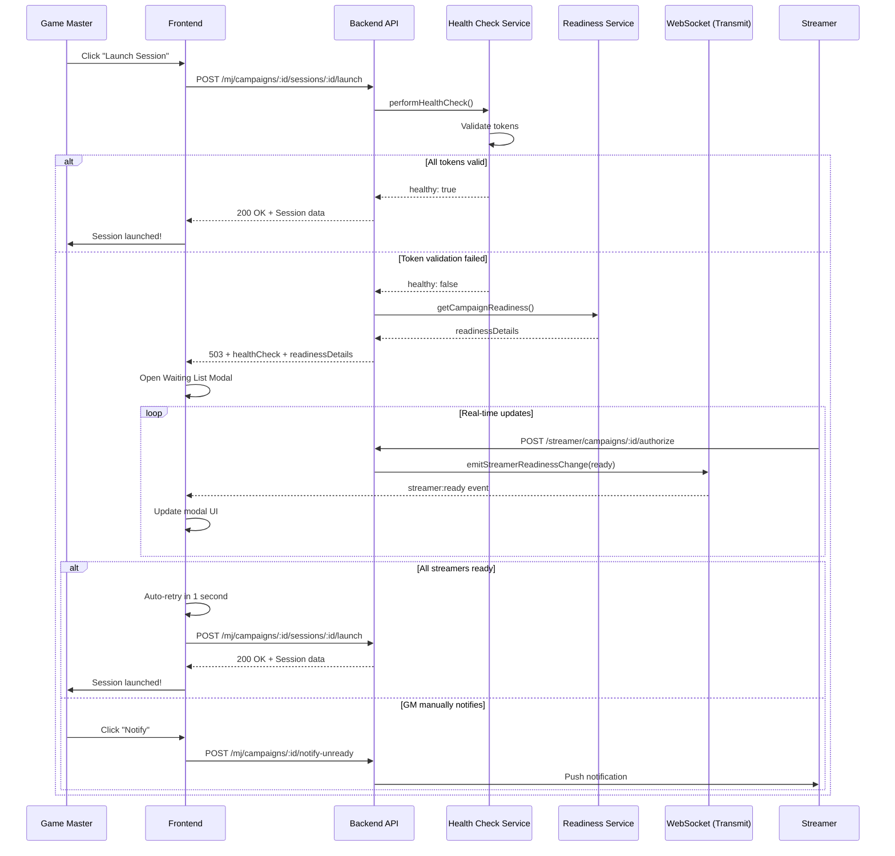

# Streamer Readiness & Waiting List

The Streamer Readiness system provides real-time visibility into which streamers are ready to participate in poll sessions, and automatically blocks session launches when streamers have issues (expired tokens, missing authorizations, etc.).

## Overview

When a GM attempts to launch a poll session, the system performs a health check. If token validation fails, the backend returns `readinessDetails` that trigger a **Waiting List Modal** in the frontend. This modal:

- Shows which streamers are ready/not ready
- Displays specific issues preventing readiness
- Updates in real-time via WebSocket
- Auto-retries session launch when all streamers are ready
- Allows GM to notify unready streamers via push notifications

## Architecture

### Backend Components

```
backend/app/
├── services/
│   └── campaigns/
│       └── readiness_service.ts          # Readiness calculation logic
├── dtos/
│   └── campaigns/
│       └── streamer_readiness_dto.ts     # Type definitions
└── controllers/
    └── mj/
        ├── campaigns_controller.ts        # Readiness API endpoints
        └── poll_sessions_controller.ts    # Launch with health check
```

### Frontend Components

```
frontend/
├── stores/
│   └── streamerReadiness.ts              # Pinia store for readiness state
├── composables/
│   ├── useReadiness.ts                   # API calls composable
│   └── useWebSocket.ts                   # WebSocket subscription
└── components/
    ├── WaitingListModal.vue              # Main waiting list UI
    └── StreamerReadinessItem.vue         # Individual streamer status
```

## Readiness Criteria

A streamer is considered **ready** when ALL of the following are true:

1. **Active Account:** `streamer.isActive === true`
2. **Valid Token:** Token is not expired and no refresh failures
3. **Active Authorization:** 12-hour poll authorization has not expired

### Readiness Issues

| Issue Type              | Description                                    | Resolution                                          |
| ----------------------- | ---------------------------------------------- | --------------------------------------------------- |
| `streamer_inactive`     | Streamer account is deactivated                | User must re-authenticate via Twitch OAuth          |
| `token_expired`         | Twitch access token has expired                | Auto-refresh will attempt, or user re-authenticates |
| `token_refresh_failed`  | Token refresh failed (marked for deactivation) | User must re-authenticate                           |
| `authorization_missing` | Streamer has never authorized their channel    | Streamer must click "Authorize" button              |
| `authorization_expired` | 12-hour authorization period has expired       | Streamer must re-authorize                          |

## User Flow

### Complete Sequence Diagram



### Step-by-Step Flow

#### 1. Session Launch Initiated

GM clicks "Launch Session" button:

```typescript
// frontend/composables/useReadiness.ts
const launchSession = async (campaignId: string, sessionId: string) => {
  const response = await fetch(
    `${API_URL}/mj/campaigns/${campaignId}/sessions/${sessionId}/launch`,
    { method: 'POST', credentials: 'include' }
  )

  // Check for 503 with readiness details
  if (response.status === 503) {
    const data = await response.json()
    if (data.readinessDetails) {
      store.openModal(campaignId, sessionId, data.readinessDetails)
      return { success: false }
    }
  }

  return { success: true, data: response.json() }
}
```

#### 2. Health Check Fails

Backend detects token issues and returns readiness data:

```typescript
// backend/app/controllers/mj/poll_sessions_controller.ts
const healthCheck = await this.healthCheckService.performHealthCheck(campaignId, userId)

if (!healthCheck.healthy) {
  let readinessDetails = null
  if (!healthCheck.services.tokens.valid) {
    readinessDetails = await this.readinessService.getCampaignReadiness(campaignId)
  }

  return response.status(503).json({
    error: 'System health check failed. Cannot launch session.',
    healthCheck,
    readinessDetails,
  })
}
```

#### 3. Waiting List Modal Opens

Frontend receives 503 response and displays modal:

```vue
<!-- frontend/components/WaitingListModal.vue -->
<template>
  <UModal v-model:open="store.isModalOpen">
    <template #header>
      <h3>En attente des streamers</h3>
      <p>{{ store.readyCount }} / {{ store.totalCount }} prêts</p>
    </template>

    <template #body>
      <UProgress :value="store.readyPercentage" />

      <!-- Unready streamers first -->
      <StreamerReadinessItem v-for="streamer in store.unreadyStreamers" :streamer="streamer" />

      <!-- Ready streamers -->
      <StreamerReadinessItem v-for="streamer in store.readyStreamers" :streamer="streamer" />
    </template>

    <template #footer>
      <UButton @click="handleNotify"> Notifier ({{ store.unreadyStreamers.length }}) </UButton>
      <UButton @click="handleRetry" :disabled="!store.allReady"> Réessayer </UButton>
    </template>
  </UModal>
</template>
```

#### 4. WebSocket Subscription

Modal subscribes to readiness updates:

```typescript
// frontend/composables/useWebSocket.ts
const subscribeToCampaignReadiness = (
  campaignId: string,
  handlers: {
    onStreamerReady: (event: ReadinessChangeEvent) => void
    onStreamerNotReady: (event: ReadinessChangeEvent) => void
  }
) => {
  const channel = transmit.subscription(`campaign:${campaignId}:readiness`)

  channel.on('streamer:ready', handlers.onStreamerReady)
  channel.on('streamer:not-ready', handlers.onStreamerNotReady)

  await channel.create()

  return async () => {
    channel.delete()
  }
}
```

#### 5. Streamer Authorizes

When a streamer authorizes their channel, WebSocket broadcasts:

```typescript
// backend/app/services/campaigns/authorization_service.ts
async grantAuthorization(campaignId: string, streamerId: string) {
  // Refresh token first
  const refreshSuccess = await tokenRefreshService.refreshStreamerToken(streamer)
  if (!refreshSuccess) {
    throw new Error('TOKEN_REFRESH_FAILED')
  }

  // Grant 12h authorization
  await this.membershipRepository.grantPollAuthorization(membership)

  // Broadcast readiness change
  const wsService = new WebSocketService()
  wsService.emitStreamerReadinessChange(
    campaignId,
    streamerId,
    true,
    streamer.twitchDisplayName
  )
}
```

#### 6. Auto-Retry When Ready

When all streamers become ready, auto-retry launches the session:

```typescript
// frontend/components/WaitingListModal.vue
watch(
  () => store.allReady,
  async (allReady) => {
    if (allReady && store.isModalOpen && !isRetrying.value) {
      // Show success message briefly
      await new Promise((resolve) => setTimeout(resolve, 1000))
      await handleRetry()
    }
  }
)
```

## API Endpoints

### GET /mj/campaigns/:id/streamers/readiness

Retrieves the current readiness state of all streamers in a campaign.

**Authentication:** Required (GM only)

**Response:**

```json
{
  "data": {
    "campaignId": "cmp_abc123",
    "allReady": false,
    "readyCount": 2,
    "totalCount": 3,
    "streamers": [
      {
        "streamerId": "str_xyz789",
        "streamerName": "StreamerOne",
        "streamerAvatar": "https://static-cdn.jtvnw.net/...",
        "twitchUserId": "12345678",
        "isReady": true,
        "issues": [],
        "tokenValid": true,
        "authorizationActive": true,
        "authorizationExpiresAt": "2024-01-20T14:30:00Z"
      },
      {
        "streamerId": "str_def456",
        "streamerName": "StreamerTwo",
        "streamerAvatar": "https://static-cdn.jtvnw.net/...",
        "twitchUserId": "87654321",
        "isReady": false,
        "issues": ["token_expired", "authorization_missing"],
        "tokenValid": false,
        "authorizationActive": false,
        "authorizationExpiresAt": null
      }
    ]
  }
}
```

**Implementation:**

```typescript
// backend/app/controllers/mj/campaigns_controller.ts
async streamersReadiness({ auth, params, response }: HttpContext) {
  const userId = auth.user!.id

  // Verify access
  await this.campaignService.getCampaignWithMembers(params.id, userId)

  const readiness = await this.readinessService.getCampaignReadiness(params.id)

  return response.ok({ data: readiness })
}
```

### POST /mj/campaigns/:id/notify-unready

Sends push notifications to all unready streamers.

**Authentication:** Required (GM only)

**Response:**

```json
{
  "data": {
    "notified": 2,
    "streamers": ["StreamerOne", "StreamerTwo"]
  }
}
```

**Notification Payload:**

```typescript
{
  title: 'Session de sondage en attente',
  body: 'Le MJ de "Campaign Name" souhaite lancer une session. Veuillez autoriser votre chaîne.',
  data: {
    url: '/streamer',
    campaignId: 'cmp_abc123'
  },
  actions: [
    { action: 'authorize', title: 'Autoriser' },
    { action: 'dismiss', title: 'Plus tard' }
  ]
}
```

**Implementation:**

```typescript
// backend/app/controllers/mj/campaigns_controller.ts
async notifyUnready({ auth, params, response }: HttpContext) {
  const campaign = await this.campaignService.getCampaignWithMembers(params.id, userId)
  const readiness = await this.readinessService.getCampaignReadiness(params.id)
  const unreadyStreamers = readiness.streamers.filter(s => !s.isReady)

  // Get user IDs
  const userIds: string[] = []
  for (const streamer of unreadyStreamers) {
    const streamerModel = await this.streamerRepository.findById(streamer.streamerId)
    if (streamerModel?.userId) {
      userIds.push(streamerModel.userId)
    }
  }

  // Send notifications
  const pushService = new PushNotificationService()
  await pushService.sendToUsers(userIds, 'session:start_blocked', {
    title: 'Session de sondage en attente',
    body: `Le MJ de "${campaign.name}" souhaite lancer une session.`,
    data: { url: '/streamer', campaignId: params.id }
  })

  return response.ok({
    data: {
      notified: userIds.length,
      streamers: unreadyStreamers.map(s => s.streamerName)
    }
  })
}
```

### POST /mj/campaigns/:campaignId/sessions/:sessionId/launch

Launches a poll session with health check. Returns 503 with `readinessDetails` if health check fails.

**Success Response (200):**

```json
{
  "data": {
    "id": "ses_123",
    "name": "Session Name",
    "polls": [...]
  }
}
```

**Failure Response (503):**

```json
{
  "error": "System health check failed. Cannot launch session.",
  "healthCheck": {
    "healthy": false,
    "services": {
      "tokens": {
        "valid": false,
        "invalidStreamers": [...]
      }
    }
  },
  "readinessDetails": {
    "campaignId": "cmp_abc123",
    "allReady": false,
    "readyCount": 1,
    "totalCount": 3,
    "streamers": [...]
  }
}
```

## WebSocket Events

### Channel Format

```
campaign:{campaignId}:readiness
```

Example: `campaign:cmp_abc123:readiness`

### Events

#### streamer:ready

Emitted when a streamer becomes ready (token valid + authorization active).

**Payload:**

```typescript
{
  event: 'streamer:ready',
  data: {
    streamerId: 'str_xyz789',
    streamerName: 'StreamerOne',
    isReady: true,
    timestamp: '2024-01-20T12:30:00Z'
  }
}
```

**Trigger Conditions:**

- Streamer successfully authorizes their channel
- Token auto-refresh succeeds and authorization is active

#### streamer:not-ready

Emitted when a streamer becomes unready (token expired or authorization revoked).

**Payload:**

```typescript
{
  event: 'streamer:not-ready',
  data: {
    streamerId: 'str_xyz789',
    streamerName: 'StreamerOne',
    isReady: false,
    timestamp: '2024-01-20T12:30:00Z'
  }
}
```

**Trigger Conditions:**

- Token refresh fails
- Authorization expires
- Streamer becomes inactive

### Broadcasting Readiness Changes

```typescript
// backend/app/services/websocket_service.ts
emitStreamerReadinessChange(
  campaignId: string,
  streamerId: string,
  isReady: boolean,
  streamerName: string
): void {
  const channel = `campaign:${campaignId}:readiness`

  transmit.broadcast(channel, {
    event: isReady ? 'streamer:ready' : 'streamer:not-ready',
    data: {
      streamerId,
      streamerName,
      isReady,
      timestamp: new Date().toISOString()
    }
  })
}
```

## Readiness Service Logic

### Calculating Readiness

```typescript
// backend/app/services/campaigns/readiness_service.ts

async getCampaignReadiness(campaignId: string): Promise<CampaignReadinessDto> {
  // Load active memberships with streamers
  const memberships = await this.membershipRepository.findActiveByCampaign(campaignId)

  // Calculate readiness for each
  const streamers: StreamerReadinessDto[] = []
  for (const membership of memberships) {
    const streamerReadiness = this.getStreamerReadiness(membership)
    streamers.push(streamerReadiness)
  }

  // Calculate stats
  const readyCount = streamers.filter(s => s.isReady).length
  const totalCount = streamers.length
  const allReady = readyCount === totalCount && totalCount > 0

  return {
    campaignId,
    allReady,
    readyCount,
    totalCount,
    streamers
  }
}
```

### Issue Detection

```typescript
private detectIssues(
  membership: CampaignMembership,
  streamer: Streamer
): ReadinessIssue[] {
  const issues: ReadinessIssue[] = []

  // 1. Check if streamer is active
  if (!streamer.isActive) {
    issues.push('streamer_inactive')
    return issues // Don't check further
  }

  // 2. Check token refresh failed (priority over expired)
  if (streamer.tokenRefreshFailedAt) {
    issues.push('token_refresh_failed')
  }
  // 3. Check if token is expired
  else if (streamer.isTokenExpired) {
    issues.push('token_expired')
  }

  // 4. Check authorization
  if (!membership.pollAuthorizationExpiresAt) {
    issues.push('authorization_missing')
  } else if (!membership.isPollAuthorizationActive) {
    issues.push('authorization_expired')
  }

  return issues
}
```

### Token vs Authorization Status

```typescript
// Token is valid if not expired and no refresh failures
const tokenValid =
  !issues.includes('token_expired') &&
  !issues.includes('token_refresh_failed') &&
  !issues.includes('streamer_inactive')

// Authorization is active if not missing or expired
const authorizationActive =
  !issues.includes('authorization_missing') && !issues.includes('authorization_expired')

// Streamer is ready only if both are true
const isReady = issues.length === 0
```

## Frontend State Management

### Pinia Store

```typescript
// frontend/stores/streamerReadiness.ts
export const useStreamerReadinessStore = defineStore('streamerReadiness', () => {
  const readiness = ref<CampaignReadiness | null>(null)
  const isModalOpen = ref(false)
  const pendingSessionId = ref<string | null>(null)
  const pendingCampaignId = ref<string | null>(null)

  // Computed
  const allReady = computed(() => readiness.value?.allReady ?? false)
  const readyCount = computed(() => readiness.value?.readyCount ?? 0)
  const unreadyStreamers = computed(
    () => readiness.value?.streamers.filter((s) => !s.isReady) ?? []
  )

  // Actions
  function openModal(campaignId: string, sessionId: string, data: CampaignReadiness) {
    pendingCampaignId.value = campaignId
    pendingSessionId.value = sessionId
    readiness.value = data
    isModalOpen.value = true
  }

  function updateStreamerStatus(event: ReadinessChangeEvent) {
    const streamer = readiness.value?.streamers.find((s) => s.streamerId === event.streamerId)
    if (streamer) {
      streamer.isReady = event.isReady
      if (event.isReady) {
        streamer.issues = []
      }
      // Recalculate counts
      readiness.value.readyCount = readiness.value.streamers.filter((s) => s.isReady).length
      readiness.value.allReady = readiness.value.readyCount === readiness.value.totalCount
    }
  }

  return {
    readiness,
    isModalOpen,
    allReady,
    readyCount,
    unreadyStreamers,
    openModal,
    updateStreamerStatus,
  }
})
```

### WebSocket Integration

```typescript
// frontend/components/WaitingListModal.vue
const setupWebSocketSubscription = () => {
  if (!store.pendingCampaignId) return

  unsubscribe = subscribeToCampaignReadiness(store.pendingCampaignId, {
    onStreamerReady: (event) => {
      store.updateStreamerStatus(event)
    },
    onStreamerNotReady: (event) => {
      store.updateStreamerStatus(event)
    },
  })
}

// Auto-cleanup when modal closes
watch(
  () => store.isModalOpen,
  (isOpen) => {
    if (isOpen) {
      setupWebSocketSubscription()
    } else {
      cleanupSubscription()
    }
  }
)
```

## Token Refresh Integration

### Auto-Refresh During Authorization

When a streamer clicks "Authorize", the system refreshes their token first:

```typescript
// backend/app/services/campaigns/authorization_service.ts
async grantAuthorization(campaignId: string, streamerId: string) {
  // Refresh token BEFORE granting authorization
  const refreshSuccess = await tokenRefreshService.refreshStreamerToken(streamer)

  if (!refreshSuccess) {
    throw new Error('TOKEN_REFRESH_FAILED')
  }

  // Grant 12h authorization
  await this.membershipRepository.grantPollAuthorization(membership)

  // Broadcast readiness change
  wsService.emitStreamerReadinessChange(campaignId, streamerId, true, ...)
}
```

### Scheduled Refresh

The scheduler refreshes tokens every 3h30 for streamers with active authorization:

```typescript
// backend/app/services/scheduler/token_refresh_scheduler.ts
Scheduler.call(async () => {
  const service = new TokenRefreshService()
  const report = await service.refreshAllActiveTokens()

  // Failed refreshes trigger retry policy
  // Second failure deactivates streamer and broadcasts "not-ready"
})
  .everyThreeHours()
  .everyThirtyMinutes()
```

See [Token Refresh Documentation](./TOKEN_REFRESH.md) for details.

## UI Components

### Streamer Readiness Item

Displays individual streamer status with issues:

```vue
<template>
  <div class="flex items-center gap-3 p-3 rounded-lg border">
    <!-- Avatar -->
    

    <!-- Info -->
    <div class="flex-1">
      <p class="font-semibold">{{ streamer.streamerName }}</p>

      <!-- Issues -->
      <div v-if="!streamer.isReady" class="flex gap-1 mt-1">
        <UBadge v-for="issue in streamer.issues" color="warning">
          {{ issueLabel(issue) }}
        </UBadge>
      </div>
    </div>

    <!-- Status Icon -->
    <UIcon
      :name="streamer.isReady ? 'i-lucide-check-circle' : 'i-lucide-alert-circle'"
      :class="streamer.isReady ? 'text-success' : 'text-warning'"
    />
  </div>
</template>

<script setup lang="ts">
const issueLabel = (issue: ReadinessIssue): string => {
  const labels: Record<ReadinessIssue, string> = {
    token_expired: 'Token expiré',
    token_refresh_failed: 'Refresh échoué',
    authorization_missing: 'Non autorisé',
    authorization_expired: 'Autorisation expirée',
    streamer_inactive: 'Compte inactif',
  }
  return labels[issue]
}
</script>
```

## Testing

### Unit Tests

```bash
# Backend
cd backend
npm run test:unit -- tests/unit/services/readiness_service.spec.ts

# Frontend
cd frontend
npm run test -- stores/streamerReadiness.spec.ts
```

### Integration Tests

```bash
cd backend
npm run test:functional -- tests/functional/readiness.spec.ts
```

### Manual Testing Scenarios

#### Scenario 1: All Streamers Ready

1. Create campaign with 3 active streamers
2. All streamers authorize their channels
3. Click "Launch Session"
4. **Expected:** Session launches immediately (no modal)

#### Scenario 2: One Streamer Not Authorized

1. Create campaign with 2 streamers
2. Only one streamer authorizes
3. Click "Launch Session"
4. **Expected:** Waiting list modal opens showing 1/2 ready
5. Second streamer authorizes
6. **Expected:** Modal auto-retries and closes, session launches

#### Scenario 3: Token Expired

1. Manually expire a streamer's token in database:
   ```sql
   UPDATE streamers
   SET token_expires_at = NOW() - INTERVAL '1 hour'
   WHERE id = 'str_xxx';
   ```
2. Click "Launch Session"
3. **Expected:** Health check attempts auto-refresh
4. If refresh succeeds: Session launches
5. If refresh fails: Waiting list modal shows `token_expired` issue

#### Scenario 4: Notify Unready Streamers

1. Open waiting list modal with unready streamers
2. Click "Notifier" button
3. **Expected:**
   - Push notifications sent to unready streamers
   - Toast confirmation in GM's UI
   - Streamers receive notification with "Authorize" action

## Troubleshooting

### Modal Doesn't Open

**Symptoms:** Session launch fails but no modal appears

**Debugging:**

1. Check browser console for errors
2. Verify response includes `readinessDetails`:
   ```javascript
   console.log('Launch response:', response.status, await response.json())
   ```
3. Check Pinia store state:
   ```javascript
   console.log(useStreamerReadinessStore().isModalOpen)
   ```

### WebSocket Updates Not Working

**Symptoms:** Streamer authorizes but modal doesn't update

**Debugging:**

1. Check WebSocket connection:
   ```javascript
   console.log(transmit.subscription('campaign:cmp_xxx:readiness'))
   ```
2. Verify backend is broadcasting:
   ```bash
   grep "streamer:ready" logs/app.log
   ```
3. Check subscription handlers are registered:
   ```javascript
   console.log('Subscription active:', !!unsubscribe)
   ```

### Auto-Retry Doesn't Work

**Symptoms:** All streamers ready but session doesn't launch

**Debugging:**

1. Check `allReady` computed:
   ```javascript
   console.log('All ready:', store.allReady, store.readyCount, store.totalCount)
   ```
2. Verify watcher is active:
   ```javascript
   watch(
     () => store.allReady,
     (val) => console.log('All ready changed:', val)
   )
   ```
3. Check for errors in retry handler

### Notifications Not Received

**Symptoms:** "Notify" button works but streamers don't get push notifications

**Debugging:**

1. Verify push notification service is configured
2. Check streamer has userId:
   ```sql
   SELECT id, user_id FROM streamers WHERE id = 'str_xxx';
   ```
3. Check notification preferences allow `session:start_blocked`
4. Verify service worker is registered in browser

## Performance Considerations

### Readiness Calculation

- **Complexity:** O(n) where n = number of active members
- **Database queries:** 1 (with eager loading)
- **Typical duration:** 50-200ms for 10 streamers

### WebSocket Broadcasting

- **Latency:** 10-50ms for event delivery
- **Scalability:** Transmit handles 1000+ concurrent connections per instance
- **Bandwidth:** ~500 bytes per readiness event

### Optimization Tips

1. **Cache readiness state:** Store in Redis with 30s TTL
2. **Debounce WebSocket updates:** Batch rapid changes
3. **Lazy load streamer avatars:** Use progressive image loading

## See Also

- [Health Check System](./health-check.md) - Pre-flight validation before launch
- [Token Refresh](./TOKEN_REFRESH.md) - Automatic token refresh scheduler
- [Push Notifications](./push-notifications.md) - Notification system documentation
- [WebSocket Architecture](./websockets.md) - Real-time communication patterns
